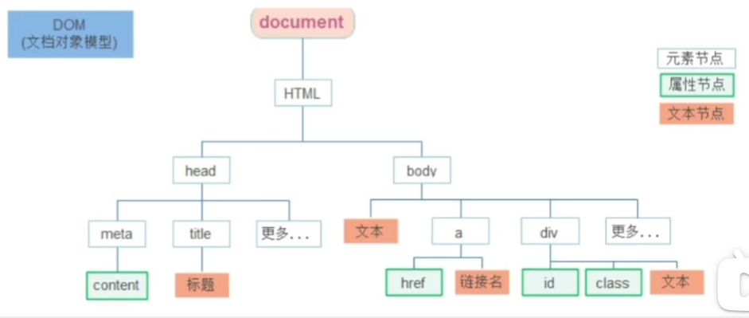

Document Object Model，文档对象模型

将标记语言的各个组成部分封装为对应的对象：
- Document : 整个文档对象Element:元素对象
- Attribute ：属性对象
- Text ：文本对象
- Comment : 注释对象

JavaScript通过DOM，就能够对HTML进行操作：
1. 改变HTML元素的内容
2. 改变HTML元素的样式（CSS）
3. 对HTMLDOM事件作出反应
4. 添加和删除HTML元素

DOM是W3C（万维网联盟）的标准，定义了访问HTML和XML文档的标准，分为3个不同的部分：

1. CoreDOM-所有文档类型的标准模型
- Document:整个文档对象
- Element：元素对象
- Attribute：属性对象
- Text：文本对象
- Comment：注释对象

2. XMLDOM-XML文档的标准模型
3. HTMLDOM-HTML文档的标准模型
- Image: \
- Button : \<input type='button'>

Document对象中提供了以下获取Element元素对象的函数：

1. 根据id属性值获取，返回单个Element对象
```js
var h1 = document.getElementById('h1');
```

2. 根据标签名称获取，返回Element对象数组
```js
var divs =document.getElementsByTagName('div');
```

3. 根据name属性值获取，返回Element对象数组
```js
var hobbys = document.getElementsByName('hobby');
```

4. 根据class属性值获取，返回Element对象数组
```js
var clss = document.getElementsByClassName('cls');
```

# 事件监听

## 事件的绑定
1. 通过html和js结合的方式绑定
```js
<input "button" id="btn1" value="事件绑定1" onclick="clickfunc()">

function clickfunc(){
	alert("被点击了");
}
```

2. 通过js绑定
```js
<input "button" id="btn1" value="事件绑定1">

document.getElementById("btn1").onclick=function(){
	alert("被点击了");
};
```

## 常见事件

| 事件名         | 说明           |
| ----------- | ------------ |
| onclick     | 鼠标单击事件       |
| onblur      | 元素失去焦点       |
| onfocus     | 元素获得焦点       |
| onload      | 某个页面或图像被完成加载 |
| onsubmit    | 当表单提交时触发该事件  |
| onkeydown   | 某个键盘的键被按下    |
| onmouseover | 鼠标被移到某元素之上   |
| onmouseout  | 鼠标从某元素移开     |

## 根据css选择器来获取dom元素

### 选择匹配的第一个元素
如果没有匹配到返回null
```js
document.querySelector('css选择器')
```

例如:
```js
const li=document.querySelector('ul li:first-child')
```
获取ul中第一个li盒子

### 选择匹配的多个元素
```js
document.querySelectorAll('css选择器')
```
获取到的是一个伪数组
有长度有索引号但没有pop和push方法

## 其他获取dom元素的方法

### 根据id获取一个元素

```js
document.getElementById('nav')
```
### 根据标签获取一类元素 获取页面所有div
```js
document.getElementsByTagName('div')
```
### 根据类名获取元素获取页面所有类名为W的
```js
document.getElementsByClassName('w')
```

## 操作元素内容

### innerText属性
要使用转义字符的话是使用反引号引用

获取标签的文本属性,可以进行更改,但现实的是纯文本不解析标签
```js
box.innerText()
```

### innerHTML
获取标签的文本属性解析标签
```js
box.innerHTML()
```

## 修改常见属性

### 修改图片属性
获取到图片对象后直接更改src属性即可
```js
img.src="images/2.webp"
```

### 修改样式属性
```js
对象.style.样式属性='值'
```
值必须用引号引用

例如
```js
box.style.width='300px'
```

多组单词的属性是小驼峰命名法
```js
box.style.backgroundColor
```

### 更改类名
可以直接对对象的类名进行更改来实现样式的转换
```js
对象.className='类名'
```
但className只能修改类名,因此在一个元素有多个类名的时候还要添加上要保留的类名

### 通过classList操作类
为了解决className容易覆盖以前的类名，我们可以通过classList方式追加和删除类名

### 追加一个类
```js
元素.classList.add('类名')
```

#### 删除一个类
```js
元素.classList.remove('类名')
```

#### 切换一个类
有这个类名就删除掉该类名,没有这个类名就添加该类名,相当于取反
```js
元素.classList.toggle('类名')
```

## 获取表单值
```js
对象.属性名
```

### 操作表单属性

复选框选中
```js
ipt.checked=true
```

按钮禁用
```js
btn.disabled=true
```

## 自定义属性
对于一个标签我们可以自定义属性,但是自定义属性名又会带来阅读障碍,在html5推出了专门的data-自定义属性
在自定义属性同一伪data-开头
在DOM对象上一律以dataset对象方式获取
通过dataset方式获取的属性存在一个map容器中,其中的键是去了data-的属性名

```js
//data-id="1"
box.dataset.id
```

## 定时器-间歇函数

- 函数 : 每隔间隔的时间调用一次该函数
- 间隔时间 : 单位毫秒
- 返回定时器的id
```js
setInterval(函数,间隔时间)
```

# 事件监听

事件监听三要素：
- 事件源：那个dom元素被事件触发了，要获取dom元素
- 事件类型：用什么方式触发，比如鼠标单击click、鼠标经过mouseover等
- 事件调用的函数：要做什么事

```js
元素对象.addEventListener('事件类型',要执行的函数)
```

示例:
监听鼠标点击按钮事件,每次点击弹出对话框
```js
const btn = document.querySelector('button')
btn.addEventListener('click',function (){
	alert('您吉祥')
})
```

## 事件监听版本

### DOM L0
```js
事件源.on事件=函数名
```
会出现覆盖的问题,如果同时监听多个事件那么最后添加的事件会执行,前面的都不会被执行因为采取的是赋值的形式


例如按钮监听点击事件:
```js
btn.onclick=function(){ alert(被点击了) }
```

### DOM L2
就是当前正在使用的方法,添加多个事件不会被覆盖,而是按顺序指向


## 事件类型#

**鼠标事件**
- click : 鼠标点击
- mouseenter : 鼠标经过
- mouseleave : 鼠标离开

**焦点事件**
- focus : 获得焦点
- blur : 失去焦点

**键盘事件**
- keydown : 键盘按下触发
- keyup : 键盘抬起触发

**文本事件**
- input : 用户输入事件

## 事件对象
在添加事件监听时如果监听函数有参数那么第一个参数就是事件对象
```js
元素.addEventListener('click'，function (e){})
```

## this指针
this表示函数的调用者,对于普通函数来说就是window对象;
直接调用函数相当于window.函数()调用,所以在普通函数中this是window
对于事件监听的函数this相当于监听事件的对象

## 事件流
事件流指的是事件完整执行过程中的流动路径
假设页面里有个div，当触发事件时，会经历两个阶段，分别是捕获阶段、冒泡阶段
捕获阶段是从父到子冒泡阶段是从子到父
实际工作都是使用事件冒泡为主

当多个盒子嵌套时且都有各自的事件处理函数那么就会看到明显的事件流

### 事件捕获
从DOM的根元素开始去执行对应的事件（从外到里）

事件捕获需要在添加事件监听时在形参列表中指定,在第三个参数,为布尔值如果为true则开启捕获
```js
DOM.addEventListener(事件类型,事件处理函数,是否使用捕获机制)
```

### 事件冒泡
将事件捕获关闭就是事件冒泡,是默认的属性

当一个元素的事件被触发时，同样的事件将会在该元素的所有祖先元素中依次被触发。这一过程被称为事件冒泡
当一个元素触发事件后，会依次向上调用所有父级元素的同名事件

### 阻止传播
因为默认就有冒泡模式的存在，所以容易导致事件影响到父级元素
若想把事件就限制在当前元素内，就需要阻止事件冒泡
```js
事件对象.stopPropagation()
```
此方法可以阻断事件流动传播，不光在冒泡阶段有效，捕获阶段也有效

在需要组织的位置调用该函数即可组织事件接着传播
```js
document.addEventListener('click',function (){
	alert()'我是爷爷")
})
fa.addEventListener('click',function (){
	alert('我是爸爸')
})
son.addEventListener('click',function （e){
	alert（‘我是儿子"）
	//阻止流动传播
	e.stopPropagation()
})
```

## 解绑事件
```js
对象.removeEventListener('事件类型',函数名[,])
```
移除指定的事件监听函数,移除后就再发生这种事件就不会再触发了

## 事件委托
利用事件流的特征解决一些开发需求的知识技巧

优点：减少注册次数，可以提高程序性能
原理：事件委托其实是利用事件冒泡的特点.给父元素注册事件，当我们触发子元素的时候，会冒泡到父元素身上，从而触发父元素的事件

在父元素中监听事件而子元素不监听,当子元素触发事件时事件会冒泡到父元素中由父元素执行
若想要在父元素中单独对触发事件的那个子元素进行操作可以获取事件对象来使用
```js
ul.addEventListener('click',function (e){
	// alert(11)
	// this.style.color = 'red'
	// console.log(e.target)// 就是我们点击的那个对象
	e.target.style.color ='red'
})
```

## 阻止默认行为
对有默认行为的对象调用preventDefault函数即可阻止默认行为
需要借用事件监听

如:对于一个form表单,当点击提交时阻止提交
```js
form.addEventListener('submit', function (e) {
	//阻止默认行为提交
	e.preventDefault()
}
```

## 页面加载事件

### 等待加载事件
加载外部资源（如图片、外联CSS和JavaScript等）加载完毕时触发的事件

当需要一个资源时而这个资源没有加载完毕,这时候再操作这个资源就会报错

有些时候需要等页面资源全部处理完了做一些事情
老代码喜欢把script写在head中，这时候直接找dom元素找不到
都需要用到等待

给合window添加load事件
```js
window.addEventListener('load',function{
	//执行的操作
)
```

不光可以监听整个页面资源加载完毕，也可以针对某个资源绑定load事件

### DOM加载事件
当初始的HTML文档被完全加载和解析完成之后，DOMContentLoaded事件被触发，而无需等待样式表、图像等完全加载
load是也要等待css , js , 图片等资源加载完成,而DOMContenetLoaded是只等待html资源加载

给document添加DOMContenetLoaded事件
```js
document.addEventListener('DoMContentLoaded',function () {
	/执行的操作
})
```

## 页面滚动事件
页面滚动一像素就触发一次
```js
window.addEventListener('scroll', function () {
	console.log(‘我滚了')
)
```

### 获取位置
获取被卷去的大小(像素)

scrollLeft和scrollTop
获取元素内容往左、往上滚出去看不到的距离
这两个值是可读写的

#### 跳转
srollTo跳转到指定位置
```js
对象.scrollTo(x,y)
```

### 页面尺寸事件
resize事件 : 尺寸改变事件 

#### 获取元素宽高
获取元素的可见部分宽高（不包含边框，margin，滚动条等）
clientWidth和clientHeight

# 元素尺寸和位置

## 元素尺寸
获取元素的自身宽高、包含元素自身设置的宽高、padding、border
offsetWidth和offsetHeight
获取出来的是数值，方便计算
注意：获取的是可视宽高，如果盒子是隐藏的，获取的结果是0

获取元素距离自己定位父级元素的左、上距离
offsetLeft和offsetTop注意是只读属性

# 时间对象
创建实例化对象
```js
let data=new Data()
```

获取指定事件的对象
使用有参构造即可
```js
new Data('指定日期')

如:
new Data('2022-5-2')
```

### 日期对象方法

| 方法            | 作用        | 说明                  |
| ------------- | --------- | ------------------- |
| getFullYear() | 获得年份      | 获取四位年份              |
| getMonth()    | 获得月份      | 取值为0~11 , 0是一月依次类推  |
| getDate()     | 获取月份中的每一天 | 不同月份取值也不相同          |
| getDay()      | 获取星期      | 取值为 0~6 , 返回周几,周日是0 |
| getHours()    | 获取小时      | 取值为 0～23            |
| getMinutes()  | 获取分钟      | 取值为0～59             |
| getseconds()  | 获取秒       | 取值为0～59             |

### 时间戳
如果计算倒计时效果，前面方法无法直接计算，需要借助于时间戳完成
是指1970年01月01日00时00分00秒起至现在的毫秒数，它是一种特殊的计量时间的方式
将来的时间戳－现在的时间戳 = 剩余时间毫秒数

#### 获取时间戳的三种方式

**getTime获取当前时间戳**
```js
data.getTime()
```

**数字+new Data()**
会自动将时间转换成时间戳与数字进行运算
```jsjs
console.log(+new Data())    //相当于0+new Data()
```

**Data.now()静态函数**
Data中有静态函数在可以不实例化时获取时间戳
```js
console.log(Data.now())
```

# 节点操作


### DOM节点
DOM树里每一个内容都称之为节点

节点类型
- 元素节点
	所有的标签比如body、（div
	html是根节点
- 属性节点
	所有的属性生比如href
- 文本节点
	所有的文本
- 其他

经常使用的是元素节点

### 查找节点

**父节点查找**
返回最近一级的父节点找不到返回为null
```js
对象.parentNode()
```

**子节点查找**
获得所有子节点、包括文本节点（空格、换行）、注释节点等

```js
对象.childNodes()
```

也可以使用children属性获取
它与childNodes()函数的区别:
- 仅获得所有元素节点
- 返回的还是一个伪数组
```js
对象.children
```

**兄弟节点查找**
下一个兄弟节点
nextElementSibling属性

上一个兄弟节点
previousElementSibling属性

获取的是元素节点,如果要获取全部节点则是nextSiblling

### 增加节点

先创建再追加

**创建节点**
即创造出一个新的网页元素，再添加到网页内
```js
document.createElement('标签名')
```

**添加节点**

追加节点
插入到这个父元素的最后
```js
对象.appendChild(要插入的元素)
```

插入节点
插入到这个父元素中指定子元素的前面
```js
对象.insertBefore(要插入的元素,在哪个元素前面)
```

### 克隆节点

cloneNode会克隆出一个跟原标签一样的元素，括号内传入布尔值
若为true，则代表克隆时会包含后代节点一起克隆,若为false，则代表克隆时不包含后代节点.默认为false
```js
元素.cloneNode（布尔值）
```

### 删除节点

在JavaScript原生DOM操作中，要删除元素必须通过父元素删除
如不存在父子关系则删除不成功
```js
父元素.removeChild(要删除的元素)
```

# m端事件
mobile移动端事件,只对移动端有效
pc端设置无效
## 触屏事件touch（也称触摸事件）
touch对象代表一个触摸点。触摸点可能是一根手指，也可能是一根触摸笔。触屏事件可响应用户手指（或触控笔）对屏幕或者触控板操作。

常见触屏事件

| 触屏touch事件  | 说明                   |
| ---------- | -------------------- |
| touchstart | 手指触摸到一个DOM元素时触发      |
| touchmove  | 手指在一个DOM元素上滑动时触发     |
| touchend   | 手指从一个DOM元素上移开时触发<br> |

