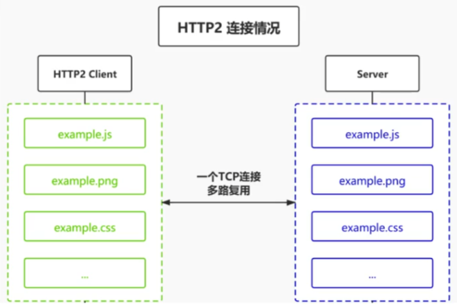
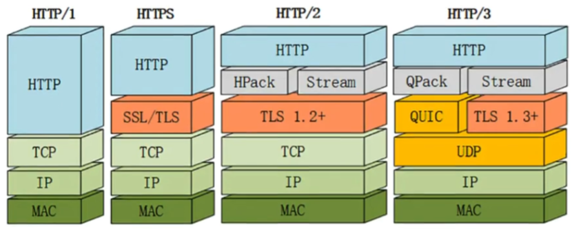

# http

## http/0.9
最早版本是1991年发布的0.9版。该版本极其简单，只有一个命令GET
```http
GET /index.html
```
上面命令表示，TCP连接（connection）建立后，客户端向服务器请求（request）网页index.html

协议规定，服务器只能回应HTML格式的字符串，不能回应别的格式。
```html
<html>
	<body>HelloWorld</body>
</html>
```
服务器发送完毕，就关闭TCP连接。

**http/0.9缺点**
1. 只能发送html
2. 命令单一

## http/1.0

1996年5月，HTTP/1.0版本发布，内容大大增加。
首先，任何格式的内容都可以发送。这使得互联网不仅可以传输文字，还能传输图像、视频、二进制文件。这为互联网的大发展奠定了基础。
其次，除了GET命令，还引I入了POST命令和HEAD命令，丰富了浏览器与服务器的互动手段
再次，HTTP请求和回应的格式也变了。除了数据部分，每次通信都必须包括头信息（HTTPheader），用来描述一些元数据。

**缺点**
每一个tcp只能发送一次请求，发送数据完毕连接就断开，如果还想发送请求就需要新建一条新的tcp连接
每发送一次请求就要经历tcp三次握手四次挥手，资源消耗大

## http/1.1

1997年1月，HTTP/1.1版本发布，它主要升级了两个功能
1. 持久连接
2. 管道机制
	同一个TCP连接里面，客户端可以同时发送多个请求。样就进一步改进了HTTP协议的效率。

客户端需要请求两个资源。以前的做法是，在同一个TCP连接里面，先发送A请求，然后等待服务器做出回应，收到后再发出B请求。管道机制则是允许浏览器同时发出A请求和B请求，但是服务器还是按照顺序，先回应A请求，完成后再回应B请求。

**http1.1的缺陷**
虽然1.1版允许复用TCP连接，而且可以同时发送多个请求，但是服务器只有处理完一个回应，才会进行下一个回应。要是前面的回应特别慢，后面就会有许多请求排队等着。这称为"队头堵塞”（Head-of-lineblocking）

**为了避免这个问题，一般处理方案：**
1. 是减少请求数合并js，合并csS，雪碧图
2. 是同时多开持久连接，资源放在多个域名下面（因为一个域名最多可以有6个tcp的连接）

## http/2
2009年，谷歌公开了自行研发的SPDY协议，主要解决HTTP/1.1的队头阻塞的问题。
这个协议在Chrome浏览器上证明可行以后，就被当作HTTP/2的基础。

2015年，http/2正式发布。
目标：
专注于性能，最大的一个目标是在用户和网站间只用一个连接。之前是一个域名可以有6个tcp连接，现在只用一个tcp连接
这样就没有握手挥手的问题；没有慢启动的问题

**核心升级点：**
1. 二进制协议
2. 多路复用
3. 头压缩
4. 服务器推送

**二进制协议**
http2采用二进制格式传输数据，而非HTTP1.x的文本格式，二进制协议解析起来更高效。HTTP/1的请求和响应报文，都是由起始行，首部和实体正文（可选）组成，各部分之间以文本换行符分隔（这种情况就不能分开传输，因为文本是根据换行符进行分割的），HTTP/2将请求和响应数据分割为更小的帧，并且它们采用二进制编码
核心：就是将数据包切开成一片一片的，然后每一片可以乱序传输；浏览器接受到所有的片后，按照片所带的序号，整合为一个完整的数据包

**多路复用**
所有的连接都复用一个tcp连接



**头压缩**
在同一个HTTP页面中，许多资源的Header是高度相似的，但是在HTTP2之前都是不会对其进行压缩的，这使得在多次传输中白白浪费了资源来进行重复无谓的操作

原本的http1.1请求头数据都是文本格式的，但在http2进行了头压缩，设置了一个映射表，每个数字代表一个配置，这样发送请求时请求头的配置就都是数字形式的（如GET请求用数字2表示）这样就极大地压缩了请求头的大小
在查看http2的请求头的时候，那些开头带冒号的字段就是在传输时进行头压缩的字段

**服务器推送**
HTTP2还在一定程度上改变了传统的“请求-应答"工作模式，服务器不再是完全被动地响应请求，也可以新建“流"主动向客户端发送消息。比如，在浏览器刚请求HTML的时候就提前把可能会用到的JS、CSS文件发给客户端，减少等待的延迟，这被称为"服务器推送"（ServerPush，也叫Cachepush）

**缺点**
1. http/2虽然解决了应用层的队头阻塞，但是并没有解决传输层的队头阻塞
只要底层是基于tcp，tcp就需要有确认的流程。
在应用层，虽然所有的数据包被切成一片一片，而且这些片的可以乱序传输；但是在tcp层，还是要将上一层的切开的片，整合为一个数据包，依然需要按照顺序去响应，依然遵循“丢包重传"机制，所以tcp层的队头阻塞的问题依然是存在的。而且更严重，应为http/2只有一个tcp连接，一旦阻塞了，这个tcp上的所有请求都被阻塞（http1.1是可以新建tcp连接），基于这个原因，http/3就诞生了。
2. 因为是基于tcp，所以建立连接会经过三次握手四次挥手【建立连接需要花费很多时间】

## http3

Google在推SPDY的时候就已经意识到了这些问题，于是就另起炉灶搞了一个基于UDP协议的“QUIC"协议。而http/3就是基于QUIC协议的。它在HTTP/2的基础上又实现了质的飞跃，真正“完美"地解决了“队头阻塞"问题。经过了多年的努力，在2022年6月，IETF（互联网工程任务小组）正式发布了HTTP/3
http/3的核心改变就是：传输层使用的UDP协议，而不是tcp协议

**QUIC**
通常来说QUIC是一种通用传输协议，与TCP非常相似。为什么要打造一套新的协议呢？这是因为现有的TCP协议扩展起来非常困难，因为已经有太多太多的设备使用了各种不同的TCP协议的版本，如果想直接在现有的TCP协议上进行扩展非常困难，因为需要给这么多台设备进行升级几乎是不可能完成的任务。所以QUIC在选择在UDP协议之上进行构建。QUIC使用UDP，主要是因为希望能让HTTP/3更容易部署，因为它已经被互联网上的所有设备所知并已实现QUIC实际上就是在UDP基础上重写了TCP的功能，但是又比TCP更加智能，更高效的实现了TCP的核心功能

因为http/3是基于UDP，所以就自动解决了下面两个问题
1. 建立连接时候的三次握手四次挥手
2. 队头阻塞（UDP是无序的，无需等待）

# https

加密版本的http
- ssl：在tcp/ip协议技术上实现的安全协议，采用公开密钥技术
- tls：加密算法：防止邮件网页消息被篡改和窃听

https：结合http添加ssltls安全措施保证数据传输的安全性

特点：
- 保密性
- 数据完整性
- 身份校验安全性

## 对称加密和非对称加密

### 对称加密
指的就是加密和解密使用同所以叫对称加密。对称加密只有一个秘钥，作为私钥。

常见的对称加密算法：DES，AES

加解密过程：
加密：原文+密钥=密文
解密：密文-密钥=原文

特点：
1. 高效：因为使用同一把钥匙，所以加密解密可以使用同一个算法，这样算法简单效率高。
2. 不安全：因为是一把钥匙，所以在网络上一旦被劫持，信息就很容易被破译

密钥由服务端或客户端生成，一方生成后就需要通过网络传输传递给对方后才能开始通信，双方都需要使用密钥来对数据进行加解密。密钥只有一个，倘若在传输密钥的时候被截取，别人也会知道密钥从而截取数据进行解密窃听

### 非对称加密
非对称加密指的是：加密和解密使用不同的秘钥，一把作为公开的公钥，另一把作为私钥。公钥加密的信息，只有私钥才能解密。

常见的非对称加密：RSA

加解密过程：
公钥加密，私钥解密

特点：
1. 加密算法复杂：因为有两把钥匙，所以加密解密肯定是不能用同一个，而且使用不同算法，不同钥匙，加解密结果要一致，所以非对称加密算法复杂很多
2. 安全性高：因为传输的只是公钥，私钥永远在自己的手里

## SSL证书

SSL证书是数字证书的一种，类似于驾驶证、护照和营业执照的电子副本。因为配置在服务器上，也称为SSL服务器证书。比如我们英语四六级证书一样的。主要证明我们过了四六级，服务器sS证书，也是为了证明服务器是安全合法的服务器。

有人可能会想，有没有伪造证书呢？我们类比我们的四六级证书，其实就是一张纸，这张纸我们随便也能仿造一张，但是这个真伪是很好识别，我们直接用证书编号到四六级官网一查就知道，如果里面的信息和这张纸上的信息一致，则说明这张证书是真实的。SSI证书也是一样的。直接去SSL证书颁发官网根据证书编号一查就知道。

1. 服务端生成公钥和私钥，通过证书将公钥传递给客户端（非对称加密）
2. 客户端生成随机数（密钥）通过公钥加密发送给服务器端（非对称加密）
	使用公钥加密的随机数只能使用私钥解密出来，这个私钥只有服务端有
3. 双方交换密钥后传递数据（对称加密）
	传递的数据需要使用密钥（随机数）进行解密，而密钥（随机数）在传输的过程中即使被劫持了也无法解密出内容，或者解密的成本巨大。也就保证了通信的安全

# 跨域问题的解决方案

## 代理服务器

生产环境没有跨域问题，而部署到服务器上的开发环境有跨域问题的情况一般采用这种方案，也是前端最常用的方案
通常是让本地服务器（与浏览器同源的）接收到浏览器的请求后（通常是地址后/api路径下的）转发请求给后端服务器，后端服务器返回数据后在转发给浏览器

## CORS
CORS是基于http1.1的一种跨域解决方案，它的全称是Cross-OriginResource-Sharing，跨域资源共享。

前端不需要做任何处理，主要是后端做的
后端对请求做验证，如果验证通过则允许访问

服务器返回的响应头中会携带Access-Control-Allow-0rigin字段，表示允许跨域访问的策略
该字段的值可以是：
- `*`：表示我很开放，什么人我都允许谈问
- 具体的源：比如http://my.com，表示只允许访问的源

针对不同的请求，CORS规定了三种不同的交互模式，分别是：
1. 简单请求
2. 需要预检的请求
3. 附带身份凭证的请求

#### 简单请求
请求方法属于下面的一种：
- get
- post
- head

请求头仅包含安全的字段，常见的安全字段如下：
- Accept
- Accept-Language
- Content-Language
- Content-Type
- DPR
- Downlink
- Save-Data
- Viewport-WidthEdu
- Width

请求头如果包含Content-Type，仅限下面的值之一：
- text/plain
- multipart/form-data
- application/x-www-form-urlencoded

#### 需要预检的请求
如果不是简单请求那么大概率就是需要预检的请求

浏览器发送预检请求，询问服务器是否允许，如果服务器允许浏览器才会发送真实请求
服务器允许后发送的非简单请求就和简单请求一样处理了

#### 携带身份凭证的请求
默认情况下，ajax的跨域请求并不会附带cookie，某些需要权限的操作就无法进
行
可以通过简单的配置就实现附带cookie
```js
// xhr
var xhr new XMLHttpRequest()
xhr.withCredentials = true

// fetch api
fetch(url,{
	credentials:include
})
```

当一个请求需要附带cookie时，无论它是简单请求，还是预检请求，都会在请求头中添
加cookie字段<而服务器响应时，需要明确告知客户端：服务器允许这样的凭据
告知需要在响应头中添加：Access-Control-Allow-Credentials为true
对于一个附带身份凭证的请求，若服务器没有明确告知，浏览器仍然视为跨域被拒绝。

对于附带身份凭证的请求，服务器不得设置Access-Control-Allow-Origin的值为`*`。

## JSONP
JSONP的方案已经过时被CORS取代，但在一些老的系统中可能会用到

JSONP的做法是：当需要跨域请求时，不使用AJAX，转而生成一个script元素去请求服务器，由于浏览器并不阻止script元素的请求，这样请求可以到达服务器。服务器拿到请求后，响应一段JS代码，这段代码实际上是一个函数调用，调用的是客户端预先生成好的函数，并把浏览器需要的数据作为参数传递到函数中，从而间接的把数据传递给客户端

JSONP的方法需要后端协同
1. 服务器设置约定好的函数已经数据
```js
getData(
	{name:'tom',age:'18'}
)
```

2. 准备一个和服务器约定好的获取数据的函数（函数名需要和后端约定的一致，参数也要一致）
```js
function getData(data){}
```

3. 生成一个script标签链接指向服务器地址
```html
<script src='http://www.baidu.com/api/data'></script>
```

当处理到script标签时会向服务器发送请求来获取这个标签中的代码（script请求js代码不受跨域的限制），服务器在这个脚本中设置好与前端约定好的同名函数并传入数据，在请求到脚本后调用同名函数执行就可以获取到数据了

JSONP有着明显的缺点，即其只能支持GET请求。因为script就是get请求
